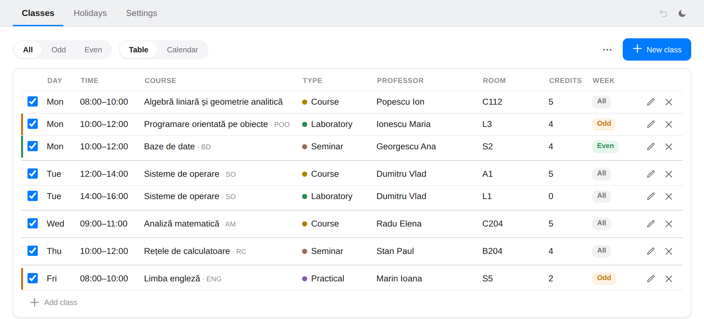
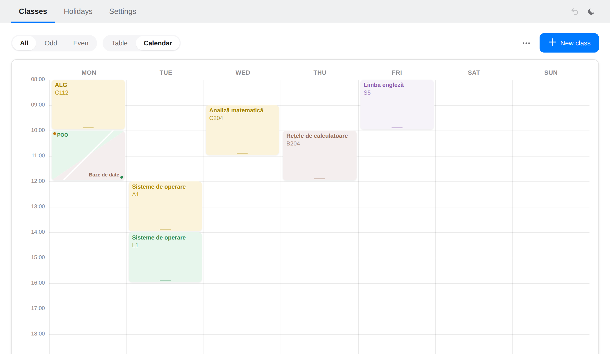

<p align="center">
  
</p>

<h1 align="center">unisch</h1>

<p align="center">
  Turn your university timetable, odd and even weeks included, into a calendar file.<br>
  <a href="https://istorie-petru.github.io/unisch/"><strong>Open unisch →</strong></a>
</p>




## What it does

Enter your classes once, then export an `.ics` file. Google Calendar,
Apple Calendar, Outlook and Thunderbird can all import it. Every class
repeats on the right weeks until the semester ends, and holidays are
skipped.

- **Odd / even weeks**: choose how your faculty counts them.
- **Holidays**: classes that fall inside a break are left out.
- **Conflicts and credits**: overlapping classes and missing credits are flagged.
- **Professors**: export a `.vcf` contacts file with each professor's courses and rooms.
- **Private**: everything stays in your browser. No account, no server, and it works offline.

## How to use it

1. **Settings**: set the semester's start and end, how weeks are counted, and optionally a time zone.
2. **Classes**: add each class with **New class**. You can also click or drag on an empty spot in the calendar.
3. **Holidays**: add the breaks.
4. **⋯ → Export .ics**: import the file into your calendar app.

To share a timetable with classmates, send them your **⋯ → Export backup**
file. They load it with **Import backup**.

### Tips

- **Calendar**: drag a class to move it, drag its bottom edge to resize it, and double-click it to edit it.
  On touch screens, press and hold before dragging, and double-tap to edit. Phones show one day at a time: swipe to change it.
- **Undo** (the arrow in the top bar, or Ctrl/⌘+Z) steps back through every change made during this visit.
- **Dates** are typed as `DD.MM.YYYY`. Typing just the digits (`28092026`) also works.
- **Keyboard**: Tab reaches every class, Enter opens it and Escape closes it.

### Week counting

| Setting | How weeks are numbered |
|---|---|
| ISO calendar week | By ISO week number. Years with 53 weeks (like 2026) put two odd weeks back to back. |
| Week count from semester start | The week containing the start date is week 1. |
| …skipping holiday weeks | The same, but a week whose Monday to Friday are all holidays isn't counted. |

**Time zone** is optional. With none set, 08:00 shows as 08:00 wherever
the calendar app is. When set, classes stay pinned to that zone,
including its summer-time changes.

## Running your own copy

It's a static site with no build step: `index.html` plus `sw.js`,
`site.webmanifest`, `favicon.ico` and `icons/`. To host your own copy,
fork this repository and turn on **Settings → Pages** (deploy from
`main`, root folder).

Tests use Playwright and run on every push:

```sh
npm ci && npx playwright install chromium && npm test
```

## License

[MIT](LICENSE)
